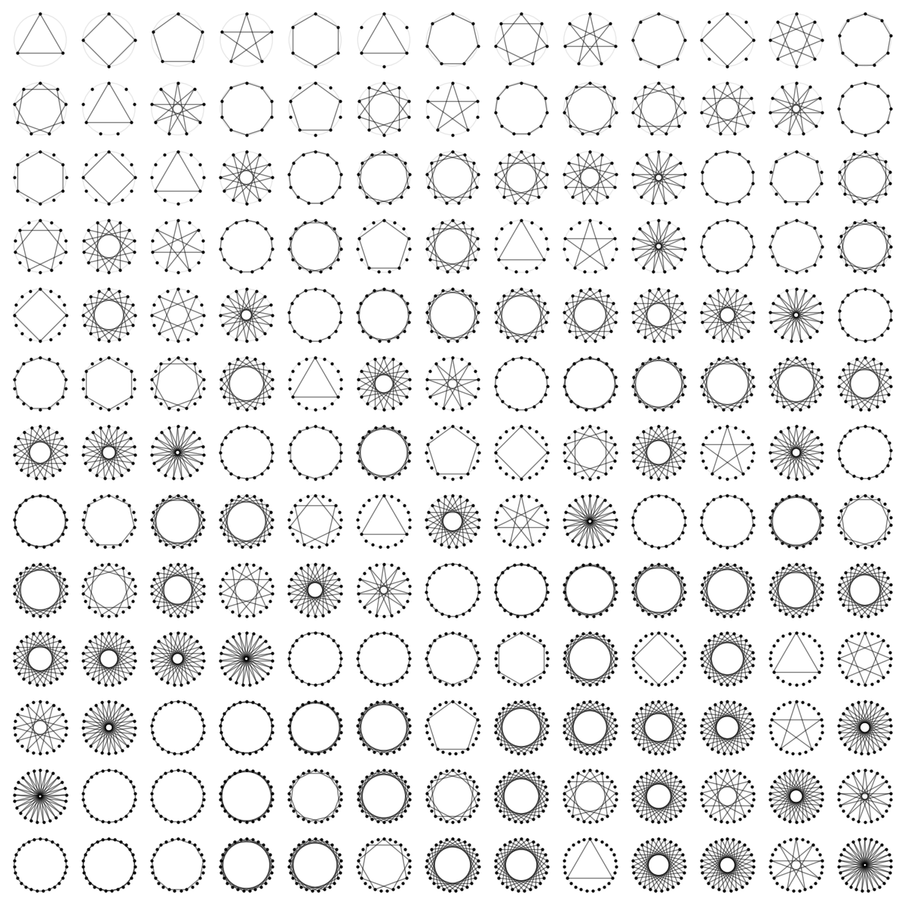

# Visualizing factors with circles

Natural numbers are cool, and so are their factors. 
This repo generates some plots to support our local math circle. 

## Installation

This project uses [pixi](https://prefix.dev/docs/pixi/) for environment management. To set up the environment and install dependencies:

```bash
pixi install
```

## Usage

You can run the script from the command line to generate a grid of number circle plots:

```bash
pixi run python number_circles/number_circles.py --max_n 10 --outfile example_plot.png
```

- `--max_n`: The maximum number to consider (inclusive).
- `--outfile`: Path to save the output image (PNG). If not provided, the plot will not be saved.
- `--dpi`: DPI of the output image

## Example Output

Below is an example of the kind of visualization you can generate. 

If a number $m$ is divisible by $n$, then a regular n-gon is formed by line segments traversing $m$ dots arranged in a circle with step size $n$.
For example, if a number is divisible by 4, we see a square. 



## License

This project is licensed under the MIT License. See the [LICENSE](LICENSE) file for details.
